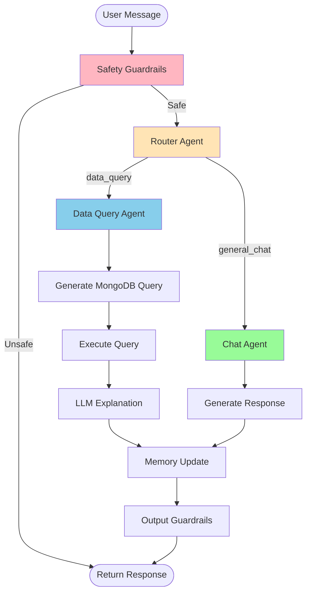

# 🏛️ California Procurement Data Assistant

A production-ready, intelligent conversational AI system that analyzes California state purchase orders using natural language queries, MongoDB aggregations, and multi-agent routing.


---

## 📋 Table of Contents

- [Overview](#overview)
- [Key Features](#key-features)
- [What's New](#whats-new)
- [System Architecture](#system-architecture)
- [Project Structure](#project-structure)
- [Installation](#installation)
- [Configuration](#configuration)
- [Usage](#usage)
- [Query Examples](#query-examples)
- [Architecture Decisions](#architecture-decisions)
- [Contributing](#contributing)

---

## 🎯 Overview

This project implements a **specialized multi-agent conversational system** for analyzing California state procurement data (2012-2015, purchases over $5,000). The system intelligently routes between data queries and general conversation:

### **Dual-Mode Intelligence:**
- 🎯 **Data Query Agent** - Answers questions using MongoDB aggregations and natural language explanations
- 💬 **Chat Agent** - Handles greetings, help requests, and general conversation
- 🔀 **Smart Router** - Automatically classifies user intent and routes to the appropriate agent

### **Core Capabilities:**
- 🧠 **Intelligent Query Generation** - Natural language → MongoDB queries using OpenAI function calling
- 💾 **Dual Memory System** - Short-term (MongoDB) + Long-term (ChromaDB) for context-aware responses
- 🛡️ **Safety Guardrails** - Input/output validation focused on safety (not topic restriction)
- 📊 **Complete Data Access** - View all results with Technical Details modal + CSV/JSON downloads
- 🎨 **Natural Language Responses** - Engaging, conversational explanations (not robotic)
- ⚡ **Real-time WebSocket** - Instant query results and detailed explanations
- 🔁 **Smart Resend** - Retry failed queries with automatic cleanup
- 📱 **Session Management** - Persistent sessions across page refreshes, history browser, and session switching

---

## 🚀 Key Features

### 1. **Intelligent Multi-Agent Routing** 🆕

The system automatically classifies user intent and routes to the appropriate agent:

```
User Message → Router Agent → Decision:
                              ├─ Data Query → MongoDB Agent
                              └─ General Chat → Chat Agent
```

**Examples:**
- "Hello!" → Chat Agent (greeting)
- "What is the average order value?" → Data Agent (query)
- "Thanks!" → Chat Agent (acknowledgment)
- "Show me top 5 suppliers" → Data Agent (aggregation)

### 2. **Complete Data Visibility with Two-Tier Query System** 🆕

**Problem Solved:** Users asking "What was the total spending by department?" need to see ALL results, not just the first 100. Downloads were limited to 100 rows even though more data existed.

**Solution: Two-Tier Query Execution**
- **Tier 1 - Fast Summary** (Limited to 100): Quick response for chat display
- **Tier 2 - Complete Data** (Up to 10,000): Full dataset for downloads and analysis
- **Total Count Tracking**: Shows actual database totals vs available data

**How It Works:**
```
Query Execution:
├─ LIMITED Query (100 results) → Fast chat summary
├─ COMPLETE Query (10,000 results) → Technical Details & downloads
└─ COUNT Query → Actual total in database

User: "What was the total spending by department?"
Response: "Looking at spending across California's departments,
Health Care Services absolutely dominates with $484M - that's
nearly 65% of all procurement spending! Here are the top 10...

💡 Want the complete breakdown of all 83 departments? Click
Technical Details below to see everything and download the data."

[Technical Details Button] → Opens modal with:
- Total results: 83 | Complete data available (83 records)
- ALL 83 results viewable (scrollable JSON)
- [📥 Download CSV] [📥 Download JSON] - Contains all 83 records
- Exact MongoDB query used
```

**Performance Benefits:**
- ⚡ **Fast chat responses** - Limited queries return quickly
- 📊 **Complete data access** - Downloads include up to 10,000 records
- 🛡️ **Safety limits** - 10K max prevents memory issues
- 📈 **Transparency** - Clear messaging about total vs available counts

### 3. **Natural, Engaging Responses** 🆕

**Before (Robotic):**
```
Found 83 results. Top 10:
1. Health Care Services, Department of: $484,370,024.90
2. Water Resources, Department of: $55,089,918.62
...
```

**After (Natural & Engaging):**
```
Looking at spending across California's departments, Health Care
Services absolutely dominates with $484M - that's nearly 65% of
all procurement spending!

**Health Care Services** leads the pack at $484.4M
**Water Resources** comes in second at $55.1M
**Transportation** rounds out the top three at $54.3M

What really stands out is how concentrated the spending is - just
these top 5 departments account for over 80% of the total budget.
```

**Personality:**
- Conversational and warm (not robotic)
- Enthusiastic about insights and patterns
- Uses natural transitions
- Tells a story with the data
- Highlights surprising findings

### 4. **Session Persistence** 🆕

**Features:**
- Sessions persist across page refreshes (localStorage)
- View all past sessions in History modal
- Load any previous conversation
- Delete unwanted sessions
- Create new sessions on demand
- Active session highlighted

**UI:**
- **New Session** button - Start fresh conversation
- **History** button - Browse all past sessions
- **Clear Chat** button - Clear current session

### 5. **Safety-Focused Guardrails** 🆕

**Changed Approach:**
- ❌ Old: Blocked non-procurement topics (prevented chat)
- ✅ New: Safety checks only (allows chat + data queries)

**What's Protected:**
- Length limits (max 5000 chars)
- Harmful content detection
- Prompt injection attempts
- Basic PII detection (emails, SSNs)
- HTML/script tag stripping
- XSS prevention

**What's Allowed:**
- Greetings and casual chat
- Help requests
- Data queries
- Clarification questions

### 6. **Intelligent Query System**

- **Natural Language to MongoDB**: Converts questions like "How many purchases in 2014?" to MongoDB aggregation pipelines
- **Function Calling**: Uses OpenAI's function calling API (`tool_choice="required"`) for structured query generation
- **Date Handling**: Automatic datetime parsing with `__datetime__` placeholder system
- **Query Validation**: Ensures valid MongoDB operations (find, aggregate, count)
- **Error Recovery**: Helpful error messages with retry functionality

### 7. **Advanced Memory Management**

**Short-Term Memory (MongoDB):**
- Stores recent conversation history
- Fast access for current session context
- Message-level granularity
- Used for immediate context

**Long-Term Memory (ChromaDB):**
- Semantic search using Sentence Transformers
- Stores meaningful Q&A pairs
- Smart duplicate detection (last 5 messages)
- Context retrieval for similar queries

### 8. **Data Analysis Capabilities**

- **Aggregations**: Group by department, supplier, date ranges
- **Filtering**: Find orders by price, date, department
- **Statistics**: Average, sum, count, min, max
- **Sorting**: Order results by any field
- **Date Operations**: Year, quarter, month-based analysis

### 9. **Modern User Interface**

- **Real-time Chat**: WebSocket-based instant messaging
- **Smart Resend Button**: Automatically removes old responses when retrying
- **Technical Details Modal**: View complete results + download options
- **Welcome Message**: Fades on first user message
- **Responsive Design**: Works on desktop, tablet, and mobile
- **Professional Styling**: Calm color palette, smooth animations

---

## 🆕 What's New

### Recent Updates

#### **v2.0.0 - Multi-Agent Intelligence (Latest)**

✨ **Major Features:**
- **Multi-Agent Routing**: Automatic classification between data queries and general chat
- **Chat Agent**: Handles greetings, help, and casual conversation
- **Complete Data Access**: Technical Details modal shows ALL results with download buttons
- **Natural Language Responses**: Engaging, conversational explanations
- **Session Persistence**: Sessions persist across page refreshes
- **Session History**: Browse, load, and manage all past conversations
- **Safety Guardrails**: Focused on safety, not topic restriction

🔧 **Improvements:**
- LLM responses now tell a story with the data
- Increased sample size from 5 to 15 for better summaries
- Smart pagination awareness in responses
- CSV and JSON download functionality
- Fixed timezone issues in session timestamps
- Improved resend button behavior (removes all subsequent messages)

🐛 **Bug Fixes:**
- Fixed router model name (gpt-4o-mini instead of gpt-5-mini)
- Fixed welcome message persistence
- Fixed messageId parameter order in JavaScript
- Fixed session timestamp UTC conversion

---

## 🏗️ System Architecture

### High-Level Architecture

```
┌─────────────────────────────────────────────────────────────┐
│                         User Input                           │
└──────────────────────┬──────────────────────────────────────┘
                       ↓
┌─────────────────────────────────────────────────────────────┐
│                   Safety Guardrails                          │
│  • Length limits  • Harmful content  • PII detection         │
└──────────────────────┬──────────────────────────────────────┘
                       ↓
┌─────────────────────────────────────────────────────────────┐
│                    Router Agent (GPT-4o-mini)                │
│  Classifies: data_query OR general_chat                     │
└──────┬──────────────────────────────────────────┬───────────┘
       │                                           │
       ↓                                           ↓
┌─────────────────────┐              ┌─────────────────────────┐
│   Data Query Agent  │              │    General Chat Agent    │
│   • MongoDB Query   │              │   • Greetings           │
│   • LLM Explanation │              │   • Help & Guidance     │
│   • Technical Data  │              │   • Conversation        │
└─────────┬───────────┘              └──────────┬──────────────┘
          │                                     │
          ↓                                     ↓
┌─────────────────────────────────────────────────────────────┐
│                    Memory System                             │
│  Short-term (MongoDB)  +  Long-term (ChromaDB)              │
└─────────────────────────────────────────────────────────────┘
```

### Router Decision Logic

```
Input: "Hello!"
  ↓ Router Analysis
  → Keywords: greeting, casual
  → Decision: general_chat
  → Route to: Chat Agent
  → Response: "Hi! I'm here to help..."

Input: "What is the average order value?"
  ↓ Router Analysis
  → Keywords: what is, average, value (data question)
  → Decision: data_query
  → Route to: Data Agent
  → MongoDB Query: { $group: { _id: null, avg: { $avg: "$total_price" }}}
  → Response: "The average order value is approximately $237,301.49..."
```

### LangGraph Workflow



---

## 📁 Project Structure

```
procurement_experiments/
│
├── procurement_agent/                 # Main application package
│   ├── api/                          # FastAPI application
│   │   ├── main.py                   # Server, WebSocket, REST endpoints
│   │   └── __init__.py
│   │
│   ├── graph/                        # LangGraph workflow components
│   │   ├── router_node.py            # 🆕 Intent classification router
│   │   ├── chat_agent_node.py        # 🆕 General conversation agent
│   │   ├── procurement_agent_node.py # Data query agent
│   │   ├── memory_nodes.py           # Memory fetch/update nodes
│   │   ├── guardrails.py             # 🆕 Safety-focused guardrails
│   │   ├── duplicate_detection.py    # Smart deduplication
│   │   └── __init__.py
│   │
│   ├── memory/                       # Dual memory system
│   │   ├── short_term.py             # MongoDB conversation history
│   │   ├── long_term.py              # ChromaDB semantic memory
│   │   └── __init__.py
│   │
│   ├── prompts/                      # System prompts
│   │   └── prompts.py                # 🆕 Query generation + explanations
│   │
│   ├── static/                       # Frontend assets
│   │   ├── index.html                # 🆕 Chat UI with session management
│   │   ├── app.js                    # 🆕 WebSocket + download functionality
│   │   └── style.css                 # 🆕 Professional styling
│   │
│   ├── mongodb_query.py              # 🆕 Enhanced query agent with natural responses
│   ├── workflow.py                   # 🆕 Multi-agent LangGraph workflow
│   ├── config.py                     # Configuration management
│   └── __init__.py
│
├── experiment.ipynb                  # Original Jupyter notebook
├── requirements.txt                  # Python dependencies
├── .env.example                      # Environment variables template
└── README.md                         # This file
```

---

## 📦 Installation

### Prerequisites

- Python 3.10+
- MongoDB 4.4+ (running locally or remote)
- OpenAI API key
- 4GB+ RAM (for Sentence Transformers embeddings)

### Step 1: Clone the Repository

```bash
git clone https://github.com/abdelmageed95/procurement-agent.git
cd procurement-agent
```

### Step 2: Create Virtual Environment

```bash
python -m venv venv
source venv/bin/activate  # On Windows: venv\Scripts\activate
```

### Step 3: Install Dependencies

```bash
pip install -r requirements.txt
```


### Step 4: Set Up Environment Variables

Edit `.env`:

```env
# OpenAI Configuration
OPENAI_API_KEY=sk-your_openai_api_key_here
LLM_MODEL=gpt-4o-mini

# MongoDB Configuration
MONGO_URI=mongodb://localhost:27017
MONGO_DB=procurement_db
MONGO_COLLECTION=purchase_orders

# Application Configuration
ENABLE_GUARDRAILS=true
LOG_LEVEL=INFO

# Memory Configuration
SHORT_TERM_LIMIT=10
LONG_TERM_TOP_K=3
```

### Step 5: Load Procurement Data

**Option A: Import from CSV**
```bash
mongoimport --db procurement_db --collection purchase_orders \
  --type csv --headerline --file procurement_data.csv
```

**Option B: Use existing MongoDB**
Update `MONGO_URI` to point to your existing database.

### Step 6: Run the Application

```bash
cd procurement_agent/api
python -m uvicorn main:app --reload --host 0.0.0.0 --port 8000
```

Access the application at: **http://localhost:8000**

---

## 💻 Usage

### Example Conversations

#### **General Chat**
```
User: "Hello!"
Agent: "Hi there! I'm your California Procurement Data Assistant.
I can help you explore and analyze California state purchase orders
over $5,000 from 2012-2015. Try asking me questions like 'What was
the total spending by department?' or 'Show me the top suppliers!'"
```

#### **Data Query with Complete Results**
```
User: "What was the total spending by department?"

Agent: "Looking at spending across California's departments, Health
Care Services absolutely dominates with $484M - that's nearly 65%
of all procurement spending!

**Health Care Services** leads the pack at $484.4M
**Water Resources** comes in second at $55.1M
**Transportation** rounds out the top three at $54.3M
**Public Health** follows at $43.6M
**Corrections and Rehabilitation** at $25.2M

What really stands out is how concentrated the spending is - just
these top 5 departments account for over 80% of the total budget.

💡 Want the complete breakdown of all 83 departments? Click Technical
Details below to see everything and download the data."

[Technical Details Button]
```

Click "Technical Details" to see:
- All 83 results in scrollable JSON
- Download CSV button (opens in Excel)
- Download JSON button (for analysis)
- Exact MongoDB query used

#### **Help Request**
```
User: "What can you do?"

Agent: "Great question! I specialize in analyzing California state
procurement data from 2012-2015. I can help you:

• Find spending by department or supplier
• Calculate averages and totals
• Filter orders by price or date
• Identify trends and patterns

Just ask me natural questions like 'How many purchases in 2014?'
or 'Show me orders over $50,000' and I'll dive into the data for you!"
```

### Supported Query Types

**✅ Data Queries (Routed to Data Agent):**
- "How many purchases were made in 2014?"
- "What was the total spending by department?"
- "Show me orders over $50,000"
- "What is the average order value?"
- "Top 5 suppliers by order count"
- "Find orders from Department of Transportation"

**✅ General Chat (Routed to Chat Agent):**
- "Hello!", "Hi there!", "Hey!"
- "Thanks!", "Thank you!"
- "What can you do?"
- "How does this work?"
- "Can you help me?"

---

## 📊 Query Examples

### 1. Aggregation with Complete Data Access

**Query:** "What was the total spending by department?"

**Generated MongoDB:**
```json
{
  "operation": "aggregate",
  "pipeline": [
    {"$group": {"_id": "$department_name", "total_spending": {"$sum": "$total_price"}}},
    {"$sort": {"total_spending": -1}},
    {"$limit": 100}
  ]
}
```

**Chat Response:**
```
Looking at spending across California's departments, Health Care
Services absolutely dominates with $484M...

[Shows top 15 results with insights]

💡 Click Technical Details to see all 83 departments and download data.
```

**Technical Details Modal:**
- Shows ALL 83 results
- Download CSV: `query-results-1234567890.csv`
- Download JSON: `query-results-1234567890.json`

### 2. Simple Count Query

**Query:** "How many purchases in 2014?"

**Generated MongoDB:**
```json
{
  "operation": "aggregate",
  "pipeline": [
    {"$match": {"creation_date": {"$gte": {"__datetime__": "2014-01-01"}, "$lt": {"__datetime__": "2015-01-01"}}}},
    {"$count": "total"}
  ]
}
```

**Response:** "Looking at 2014, California made 12,543 procurement purchases totaling $156.7M across all departments."

### 3. Find with Filter

**Query:** "Find orders over $50,000"

**Generated MongoDB:**
```json
{
  "operation": "find",
  "filter": {"total_price": {"$gt": 50000}},
  "sort": {"total_price": -1},
  "limit": 100
}
```

**Response:** "I found 1,234 orders over $50,000! The largest was a whopping $2.3M from the Department of Transportation. Here are the top orders..."

---

## 🧠 Architecture Decisions

### Why Multi-Agent Routing?

**Decision:** Separate agents for data queries vs. general chat

**Rationale:**
- ✅ **Better UX**: System can greet users and provide help
- ✅ **Specialized Agents**: Each agent excels at its specific task
- ✅ **Flexible**: Easy to add more agent types in the future
- ✅ **No Performance Impact**: Data queries go straight to MongoDB agent as before

### Why Complete Data in Technical Details?

**Decision:** Send ALL results to frontend (not just first 5)

**Rationale:**
- ✅ **User Need**: Users asking "What was X by Y?" need complete data
- ✅ **Download Capability**: Enable CSV/JSON export for external analysis
- ✅ **Transparency**: Users can verify and explore full results
- ✅ **No Pagination Complexity**: Single modal shows everything

**Implementation:**
- Chat: Shows summary (top 10-15) + insights
- Technical Details: ALL results + downloads
- Best of both worlds: Quick overview + complete access

### Why Natural Language Responses?

**Decision:** Make LLM responses engaging and conversational

**Rationale:**
- ✅ **Engagement**: Users prefer natural, story-driven explanations
- ✅ **Insights**: Highlighting patterns makes data more actionable
- ✅ **Readability**: Varied sentence structure is easier to scan
- ✅ **Brand**: Professional yet approachable tone

**Before:** "Found 83 results. Top 10: 1. Health Care: $484M..."
**After:** "Health Care Services absolutely dominates with $484M - that's nearly 65%!"

### Why Session Persistence?

**Decision:** Store session ID in localStorage and restore on page load

**Rationale:**
- ✅ **Better UX**: Users don't lose their work on accidental refresh
- ✅ **Mobile Friendly**: Survives tab switches and app minimization
- ✅ **History Management**: Easy to browse and resume old conversations
- ✅ **Simple Implementation**: No server-side session management needed

### Why Safety-Only Guardrails?

**Decision:** Check safety, not topics (router handles routing)

**Rationale:**
- ✅ **Separation of Concerns**: Router decides intent, guardrails ensure safety
- ✅ **Flexibility**: Allows both chat and data queries
- ✅ **Clear Responsibility**: Each component has one job
- ✅ **Better Performance**: No redundant topic validation

**Protected:**
- Harmful content, prompt injection, PII, XSS

**Allowed:**
- Greetings, help, data queries, clarifications

---

## 🤝 Contributing

We welcome contributions! Please follow these steps:

1. **Fork the repository**
2. **Create a feature branch:**
   ```bash
   git checkout -b feature/amazing-feature
   ```
3. **Make your changes**
4. **Commit with clear messages:**
   ```bash
   git commit -m 'Add: Multi-agent routing system'
   ```
5. **Push to your branch:**
   ```bash
   git push origin feature/amazing-feature
   ```
6. **Open a Pull Request**

### Contribution Guidelines

- ✅ Follow PEP 8 Python style guide
- ✅ Add docstrings to all functions
- ✅ Test changes manually before submitting
- ✅ Update documentation for new features
- ✅ Keep commits atomic and focused

---

## 📄 License

This project is licensed under the MIT License - see the [LICENSE](LICENSE) file for details.

---

## 🔗 Further Reading

### Documentation
- [Multi-Agent Routing](procurement_agent/graph/router_node.py)
- [MongoDB Query Agent](procurement_agent/mongodb_query.py)
- [Memory System](procurement_agent/memory/)
- [LangGraph Workflow](procurement_agent/workflow.py)
- [Guardrails Configuration](procurement_agent/graph/guardrails.py)

### External Resources
- [LangGraph Documentation](https://python.langchain.com/docs/langgraph)
- [OpenAI Function Calling](https://platform.openai.com/docs/guides/function-calling)
- [MongoDB Aggregation Pipeline](https://www.mongodb.com/docs/manual/core/aggregation-pipeline/)
- [ChromaDB Documentation](https://docs.trychroma.com/)

---

## 🙏 Acknowledgments

- **LangGraph** - Multi-agent workflow orchestration
- **OpenAI** - GPT-4o-mini for query generation and explanations
- **MongoDB** - Flexible document database for procurement data
- **ChromaDB** - Efficient vector storage for semantic memory
- **FastAPI** - Modern, fast web framework
- **Sentence Transformers** - Local embedding generation

---

## 📊 Project Stats

- **Lines of Code**: ~3,500 (Python + JavaScript)
- **Dependencies**: 15 core packages
- **Agents**: 3 (Router, Data Query, Chat)
- **Memory System**: Dual (MongoDB + ChromaDB)
- **Embedding Model**: all-MiniLM-L6-v2 (384 dims)
- **LLM**: gpt-4o-mini (cost-optimized)
- **Response Style**: Natural, conversational, engaging

---

**Built with ❤️ using LangGraph, FastAPI, MongoDB, and ChromaDB**

*An intelligent multi-agent system for California state procurement analysis (2012-2015)*
