#  Procurement Data Assistant

A production-ready, data-driven conversational AI system that analyzes California state purchase orders using natural language queries and MongoDB aggregations.


---

## Table of Contents

- [Overview](#overview)
- [Key Features](#key-features)
- [System Architecture](#system-architecture)
- [Project Structure](#project-structure)
- [Components](#components)
- [Installation](#installation)
- [Configuration](#configuration)
- [Usage](#usage)
- [API Documentation](#api-documentation)
- [Query Examples](#query-examples)
- [Architecture Decisions](#architecture-decisions)
- [Testing](#testing)
- [Contributing](#contributing)
- [License](#license)

---

## 🎯 Overview

This project implements a **specialized data-query conversational agent** for analyzing California state procurement data (2012-2015, purchases over $5,000). Unlike general-purpose chatbots, this system is purpose-built for data exploration:

**Key Characteristics:**
- 🎯 **Data-Only Agent** - No general knowledge, only procurement data queries
- 🧠 **Intelligent Query Generation** - Natural language → MongoDB queries using OpenAI function calling
- 💾 **Dual Memory System** - Short-term (MongoDB) + Long-term (ChromaDB) for context-aware responses
- 🛡️ **Input/Output Guardrails** - Content safety and query validation
- 🔄 **Smart Duplicate Detection** - Prevents redundant memory storage
- ⚡ **Real-time WebSocket** - Instant query results and detailed explanations
- 🔁 **Resend Functionality** - Retry failed queries with one click

The system features:
- ✅ **Automatic MongoDB query generation** from natural language
- ✅ **Detailed LLM explanations** of query results (always enabled)
- ✅ **Conversation memory** across sessions
- ✅ **Error handling** with helpful suggestions
- ✅ **Modern responsive UI** with professional design

---

## 🚀 Key Features

### Intelligent Query System
- **Natural Language to MongoDB**: Converts questions like "How many purchases in 2014?" to MongoDB aggregation pipelines
- **Function Calling**: Uses OpenAI's function calling API for structured query generation
- **Date Handling**: Automatic datetime parsing with `__datetime__` placeholder system
- **Query Validation**: Ensures valid MongoDB operations (find, aggregate, count)
- **Error Recovery**: Helpful error messages and retry functionality

### Memory Management
- **Short-Term Memory** (MongoDB):
  - Stores recent conversation history
  - Fast access for current session context
  - Message-level granularity

- **Long-Term Memory** (ChromaDB):
  - Semantic search using Sentence Transformers
  - Stores meaningful Q&A pairs
  - Smart duplicate detection (last 5 messages)
  - Context retrieval for similar queries

### Data Analysis Capabilities
- **Aggregations**: Group by department, supplier, date ranges
- **Filtering**: Find orders by price, date, department
- **Statistics**: Average, sum, count, min, max
- **Sorting**: Order results by any field
- **Date Operations**: Year, quarter, month-based analysis

### User Interface
- **Real-time Chat**: WebSocket-based instant messaging
- **Resend Button**: One-click retry for failed queries (appears on last message only)
- **Error Badges**: Visual indicators for query failures
- **Responsive Design**: Works on desktop, tablet, and mobile
- **Connection Status**: Live WebSocket connection indicator

### Security & Safety
- **Input Guardrails**: Validates user queries before processing
- **Output Guardrails**: Ensures safe and appropriate responses
- **Session Management**: Isolated conversations per session
- **MongoDB Injection Prevention**: Parameterized queries only

---

## 🏗️ System Architecture

### High-Level Architecture


### LangGraph Workflow

```mermaid
graph TD
    START([Start]) --> IG{Input<br/>Guardrails<br/>Enabled?}

    IG -->|Yes| IGN[Input Validation<br/>🛡️ Safety Check]
    IG -->|No| MF

    IGN -->|Safe| MF[Memory Fetch<br/>📚 Get Context]
    IGN -->|Unsafe| END

    MF --> Agent[Procurement Agent<br/>🎯 MongoDB Query]

    Agent --> QueryGen[Query Generation<br/>🤖 OpenAI Function Call]
    QueryGen --> Execute[Execute Query<br/>💾 MongoDB Operation]
    Execute --> Format[Format Results<br/>📊 LLM Explanation]

    Format --> MU[Memory Update<br/>💿 Save History]

    MU --> Dedup{Duplicate<br/>Detection}
    Dedup -->|New| SaveLT[Save to Long-term<br/>ChromaDB]
    Dedup -->|Duplicate| Skip[Skip Long-term]

    SaveLT --> OG
    Skip --> OG

    OG{Output<br/>Guardrails<br/>Enabled?}

    OG -->|Yes| OGN[Output Validation<br/>🛡️ Safety Check]
    OG -->|No| END

    OGN --> END([End])

    style START fill:#90EE90
    style END fill:#FFB6C1
    style IGN fill:#FFE4B5
    style MF fill:#E0BBE4
    style Agent fill:#87CEEB
    style QueryGen fill:#B0E0E6
    style MU fill:#E0BBE4
    style OGN fill:#FFE4B5
```



### Query Generation Flow


### Memory System Flow

```mermaid
sequenceDiagram
    participant User
    participant Workflow
    participant MemFetch
    participant MemUpdate
    participant ShortTerm
    participant LongTerm
    participant Embedder

    User->>Workflow: New query
    Workflow->>MemFetch: Fetch context

    MemFetch->>ShortTerm: Get recent messages (10)
    ShortTerm-->>MemFetch: Recent history

    MemFetch->>LongTerm: Semantic search
    Note over LongTerm: Query embedding<br/>Find similar Q&A
    LongTerm-->>MemFetch: Relevant context

    MemFetch-->>Workflow: Combined context

    Note over Workflow: Process query...<br/>Generate response

    Workflow->>MemUpdate: Save conversation turn

    MemUpdate->>ShortTerm: Save user + assistant message
    ShortTerm-->>MemUpdate: Stored

    MemUpdate->>MemUpdate: Check duplicates (last 5)

    alt Not Duplicate
        MemUpdate->>Embedder: Generate embedding
        Embedder-->>MemUpdate: Vector
        MemUpdate->>LongTerm: Store Q&A pair
        LongTerm-->>MemUpdate: ✅ Saved
    else Duplicate
        MemUpdate-->>MemUpdate: ⏭️ Skip long-term
        Note over MemUpdate: Prevents memory bloat<br/>from repeated queries
    end

    MemUpdate-->>Workflow: Complete
```



---

## 📁 Project Structure

```
precurement_experiments/
│
├── procurement_agent/                 # Main application package
│   ├── api/                          # FastAPI application
│   │   ├── main.py                   # FastAPI server & WebSocket handler
│   │   └── __init__.py
│   │
│   ├── graph/                        # LangGraph workflow components
│   │   ├── procurement_agent_node.py # Main agent (data-only)
│   │   ├── memory_nodes.py           # Memory fetch/update nodes
│   │   ├── guardrails.py             # Input/output safety
│   │   ├── duplicate_detection.py    # Smart deduplication
│   │   └── __init__.py
│   │
│   ├── memory/                       # Dual memory system
│   │   ├── short_term.py             # MongoDB conversation history
│   │   ├── long_term.py              # ChromaDB semantic memory
│   │   └── __init__.py
│   │
│   ├── prompts/                      # System prompts
│   │   └── mongodb_system_prompt.txt # Query generation prompt
│   │
│   ├── static/                       # Frontend assets
│   │   ├── index.html                # Chat interface
│   │   ├── app.js                    # WebSocket client & UI logic
│   │   └── style.css                 # Professional styling
│   │
│   ├── mongodb_query.py              # MongoDB query agent
│   ├── workflow.py                   # LangGraph workflow orchestration
│   ├── config.py                     # Configuration management
│   └── __init__.py
│
├── experiment.ipynb                  # Original Jupyter notebook
├── inspriation/                      # Reference multi-agent system
├── requirements.txt                  # Python dependencies
├── .env.example                      # Environment variables template
└── README.md                         # This file
```

---

## 🔧 Components

### 1. **Procurement Agent** (Data-Only)

The core agent that ONLY answers questions using the procurement database.

**Key Features:**
- ✅ Always queries MongoDB (no general knowledge)
- ✅ Uses LLM for error explanations
- ✅ Detailed mode always enabled
- ✅ Metadata tracking (query, count, success status)

**File:** `procurement_agent/graph/procurement_agent_node.py`

**Example Flow:**
```
User: "How many orders in 2014?"
  ↓
Agent: Generate MongoDB query
  ↓
MongoDB: Execute aggregation
  ↓
LLM: "There were 12,543 orders in 2014."
```

### 2. **MongoDB Query Agent**

Converts natural language to MongoDB queries using OpenAI function calling.

**Key Features:**
- ✅ Automatic schema inference (samples 100 documents)
- ✅ Supports find, aggregate, count operations
- ✅ Date parsing with `__datetime__` placeholders
- ✅ ObjectId and datetime serialization
- ✅ Query validation and error handling
- ✅ LLM-based result explanation

**File:** `procurement_agent/mongodb_query.py`

**Supported Operations:**
```python
# Find
{"operation": "find", "filter": {"total_price": {"$gt": 50000}}}

# Aggregate
{"operation": "aggregate", "pipeline": [
    {"$group": {"_id": "$department_name", "total": {"$sum": "$total_price"}}}
]}

# Count
{"operation": "count", "filter": {"creation_date": {"$gte": {"__datetime__": "2014-01-01"}}}}
```

### 3. **Dual Memory System**

**Short-Term Memory (MongoDB):**
- Collection: `conversation_history`
- Stores: Recent messages (last 10)
- Purpose: Immediate context for current conversation
- Fast lookup by session_id

**Long-Term Memory (ChromaDB):**
- Collection: `procurement_memory`
- Stores: Q&A pairs with embeddings
- Purpose: Semantic search for similar past queries
- Smart duplicate detection (last 5 messages)

**Files:**
- `procurement_agent/memory/short_term.py`
- `procurement_agent/memory/long_term.py`

### 4. **Guardrails System**

**Input Guardrails:**
- Validates user queries before processing
- Prevents prompt injection
- Checks for harmful content

**Output Guardrails:**
- Validates agent responses
- Ensures appropriate content
- Filters sensitive information

**File:** `procurement_agent/graph/guardrails.py`

**Configuration:** Set `ENABLE_GUARDRAILS=true` in `.env`

### 5. **WebSocket Handler**

Real-time bidirectional communication for instant query results.

**Features:**
- ✅ Session-based connections
- ✅ Automatic reconnection
- ✅ Typing indicators
- ✅ Error handling
- ✅ Message tracking (for resend)

**File:** `procurement_agent/api/main.py`

### 6. **Frontend (Single-Page Chat UI)**

**Components:**
- Chat interface with message history
- Resend button (appears on last message only)
- Connection status indicator
- Typing indicator during processing
- Error badges for failed queries
- Responsive design for all devices

**Files:**
- `procurement_agent/static/index.html`
- `procurement_agent/static/app.js`
- `procurement_agent/static/style.css`

---

## 📦 Installation

### Prerequisites

- Python 3.10+
- MongoDB 4.4+ (running locally or remote)
- OpenAI API key
- 4GB+ RAM (for Sentence Transformers embeddings)

### Step 1: Clone the Repository

```bash
git clone https://github.com/your-username/procurement-agent.git
cd procurement-agent
```

### Step 2: Create Virtual Environment

```bash
python -m venv venv
source venv/bin/activate  # On Windows: venv\Scripts\activate
```

### Step 3: Install Dependencies

```bash
pip install -r requirements.txt
```

**Key Dependencies:**
```
fastapi==0.104.1
uvicorn[standard]==0.24.0
pymongo==4.5.0
chromadb==0.4.18
sentence-transformers==2.2.2
openai==1.3.5
langgraph==0.0.20
python-dotenv==1.0.0
```

### Step 4: Set Up Environment Variables

```bash
cp .env.example .env
```

Edit `.env`:

```env
# OpenAI Configuration
OPENAI_API_KEY=sk-your_openai_api_key_here
LLM_MODEL=gpt-4o-mini

# MongoDB Configuration
MONGO_URI=mongodb://localhost:27017
MONGO_DB=procurement_db
MONGO_COLLECTION=purchase_orders

# Application Configuration
ENABLE_GUARDRAILS=true
LOG_LEVEL=INFO

# Memory Configuration
SHORT_TERM_LIMIT=10
LONG_TERM_TOP_K=3
```

### Step 5: Load Procurement Data

**Option A: Import from CSV**
```bash
mongoimport --db procurement_db --collection purchase_orders \
  --type csv --headerline --file procurement_data.csv
```

**Option B: Use existing MongoDB**
Update `MONGO_URI` to point to your existing database.

### Step 6: Run the Application

```bash
cd procurement_agent/api
uvicorn main:app --reload --host 0.0.0.0 --port 8000
```

Access the application at: **http://localhost:8000**

---

## ⚙️ Configuration

### Environment Variables

| Variable | Description | Default | Required |
|----------|-------------|---------|----------|
| `OPENAI_API_KEY` | OpenAI API key | - | ✅ Yes |
| `LLM_MODEL` | GPT model to use | `gpt-4o-mini` | No |
| `MONGO_URI` | MongoDB connection string | `mongodb://localhost:27017` | ✅ Yes |
| `MONGO_DB` | Database name | `procurement_db` | ✅ Yes |
| `MONGO_COLLECTION` | Collection name | `purchase_orders` | ✅ Yes |
| `ENABLE_GUARDRAILS` | Enable safety guardrails | `true` | No |
| `SHORT_TERM_LIMIT` | Messages in short-term memory | `10` | No |
| `LONG_TERM_TOP_K` | Relevant context to retrieve | `3` | No |

### MongoDB Query Prompt

Customize the query generation behavior by editing:

**File:** `procurement_agent/prompts/mongodb_system_prompt.txt`

**Key Sections:**
- **Operations**: Available MongoDB operations
- **Find Examples**: Sample find queries with filters
- **Aggregation Examples**: Sample aggregation pipelines
- **Date Syntax**: How to handle datetime fields
- **Field Types**: Schema information
- **Key Points**: Important rules and best practices

### Memory Configuration

Edit memory behavior in:

**File:** `procurement_agent/graph/memory_nodes.py`

```python
# Duplicate detection lookback
DUPLICATE_LOOKBACK = 5  # Check last 5 messages

# Short-term memory
SHORT_TERM_LIMIT = 10  # Recent messages to retrieve

# Long-term memory
LONG_TERM_TOP_K = 3  # Similar Q&A pairs to retrieve
```

---

## 💻 Usage

### 1. Start the Server

```bash
cd procurement_agent/api
uvicorn main:app --reload --port 8000
```

### 2. Open the UI

Navigate to: **http://localhost:8000**

### 3. Ask Data Questions

The system is designed for **data-only** queries about California procurement:

**✅ Good Queries:**
```
- "How many purchases were made in 2014?"
- "What was the total spending by department?"
- "Show me orders over $50,000"
- "What is the average order value?"
- "Which supplier had the most orders?"
- "Find orders from Department of Transportation in 2013"
```

**❌ Will Not Answer:**
```
- "What is the capital of California?" (general knowledge)
- "Tell me a joke" (not data-related)
- "How do I file taxes?" (not procurement data)
```

### 4. Understanding Responses

**Successful Query:**
```
User: "How many orders in 2014?"

Agent: "There were 12,543 purchase orders in 2014."

[Detailed badge shown]
```

**Failed Query:**
```
User: "Show me something"

Agent: "I couldn't generate a valid query for your question.
Please try rephrasing it to ask about the procurement data.
For example: 'How many orders in 2014?' or 'What is the total spending?'"

[Error badge shown] [Resend button appears]
```

### 5. Using the Resend Button

If a query fails:
1. A **resend button** (curved arrow icon) appears next to your last message
2. Click it to retry the query
3. The old response disappears
4. A new response is generated
5. Only the most recent message has the resend button

---

## 📡 API Documentation

### WebSocket Connection

**Endpoint:** `ws://localhost:8000/ws/{session_id}`

**Connect:**
```javascript
const sessionId = 'session_' + Date.now();
const ws = new WebSocket(`ws://localhost:8000/ws/${sessionId}`);

ws.onopen = () => {
  console.log('Connected');
};
```

**Send Message:**
```javascript
ws.send(JSON.stringify({
  message: "How many orders in 2014?",
  explain: true,  // Always true (detailed mode)
  messageId: "msg_" + Date.now()
}));
```

**Receive Response:**
```javascript
ws.onmessage = (event) => {
  const data = JSON.parse(event.data);

  if (data.type === 'message') {
    console.log('Response:', data.message);
    console.log('Metadata:', data.metadata);
  }
};
```

**Message Types:**
- `system`: System notifications
- `status`: Processing status (e.g., "typing")
- `message`: Agent response with metadata
- `error`: Error messages

### REST API

**Clear Session History**
```http
DELETE /sessions/{session_id}

Response: { "message": "Session cleared" }
```

**Health Check**
```http
GET /health

Response: { "status": "healthy", "mongodb": "connected" }
```

---

## 📊 Query Examples

### 1. Simple Count

**Query:** "How many purchases in 2014?"

**Generated MongoDB:**
```json
{
  "operation": "aggregate",
  "pipeline": [
    {"$match": {"creation_date": {"$gte": {"__datetime__": "2014-01-01"}, "$lt": {"__datetime__": "2015-01-01"}}}},
    {"$count": "total"}
  ]
}
```

**Response:** "There were 12,543 purchases in 2014."

### 2. Aggregation by Department

**Query:** "What is the total spending by department?"

**Generated MongoDB:**
```json
{
  "operation": "aggregate",
  "pipeline": [
    {"$group": {"_id": "$department_name", "total_spending": {"$sum": "$total_price"}}},
    {"$sort": {"total_spending": -1}},
    {"$limit": 10}
  ]
}
```

**Response:** "The top departments by spending are: Department of Transportation ($45.2M), Department of Corrections ($32.1M), ..."

### 3. Find with Filter

**Query:** "Find orders over $50,000"

**Generated MongoDB:**
```json
{
  "operation": "find",
  "filter": {"total_price": {"$gt": 50000}},
  "sort": {"total_price": -1},
  "limit": 100
}
```

**Response:** "Found 1,234 orders over $50,000. The largest order was $2.3M for the Department of Transportation."

### 4. Date Range Query

**Query:** "Show me orders from May 2013"

**Generated MongoDB:**
```json
{
  "operation": "find",
  "filter": {
    "creation_date": {
      "$gte": {"__datetime__": "2013-05-01"},
      "$lt": {"__datetime__": "2013-06-01"}
    }
  },
  "limit": 100
}
```

**Response:** "There were 543 orders in May 2013, totaling $12.3M."

### 5. Average Calculation

**Query:** "What is the average order value per department?"

**Generated MongoDB:**
```json
{
  "operation": "aggregate",
  "pipeline": [
    {"$group": {"_id": "$department_name", "avg_value": {"$avg": "$total_price"}, "count": {"$sum": 1}}},
    {"$sort": {"avg_value": -1}},
    {"$limit": 10}
  ]
}
```

**Response:** "Department of Transportation has the highest average order value at $45,231, followed by Department of Corrections at $38,567."

---

## 🧠 Architecture Decisions

### Why Data-Only Agent?

**Decision:** The agent ONLY answers questions using the procurement database.

**Rationale:**
- ✅ **Focused Purpose**: Clear, specific use case
- ✅ **Reduced Hallucinations**: No general knowledge = no false information
- ✅ **Predictable Behavior**: Users know exactly what to expect
- ✅ **Cost Efficient**: Smaller, faster models (gpt-4o-mini) work well

**Implementation:**
```python
def procurement_agent_node(state: Dict) -> Dict:
    # ALWAYS use MongoDB query agent
    mongodb_agent = get_mongodb_agent()
    result = mongodb_agent.query(user_message, explain=True)
    # No general knowledge fallback
```

### Why Dual Memory System?

**Decision:** Short-term (MongoDB) + Long-term (ChromaDB)

**Rationale:**

**Short-term Memory:**
- ✅ Fast access to recent conversation (last 10 messages)
- ✅ Simple key-value lookup by session_id
- ✅ No embedding overhead
- ✅ Perfect for immediate context

**Long-term Memory:**
- ✅ Semantic search for similar past queries
- ✅ Learns from previous conversations
- ✅ Helps with query variations ("orders" vs "purchases")
- ✅ Smart duplicate detection

**Alternative Considered:** Single memory system (rejected)
- ❌ Too slow for recent context (embedding every lookup)
- ❌ Too much storage for duplicates
- ❌ No separation of concerns

### Why Always-On Detailed Mode?

**Decision:** Detailed explanations always enabled (no toggle)

**Rationale:**
- ✅ **Better UX**: Users always get clear explanations
- ✅ **Simpler Code**: No conditional logic for modes
- ✅ **Consistent Behavior**: Predictable responses
- ✅ **Cost Acceptable**: gpt-4o-mini is inexpensive

**Previous Implementation:** Had fast/detailed toggle
- ❌ Users confused about which mode to use
- ❌ Fast mode gave cryptic responses ("Total: 12543")
- ❌ Added UI complexity

### Why Function Calling for Queries?

**Decision:** Use OpenAI function calling instead of prompt-based query generation

**Rationale:**
- ✅ **Structured Output**: Guaranteed valid JSON
- ✅ **Type Safety**: Schema validation built-in
- ✅ **Reliability**: Less hallucination in query syntax
- ✅ **Debugging**: Clear function call arguments

**Alternative Considered:** Prompt-based extraction (rejected)
- ❌ Required extensive output parsing
- ❌ More prone to syntax errors
- ❌ Harder to validate

**Implementation:**

The system uses OpenAI's function calling API with a defined tool schema:

```python
tools = [{
    "type": "function",
    "function": {
        "name": "execute_mongodb_query",
        "parameters": {
            "type": "object",
            "properties": {
                "operation": {"type": "string", "enum": ["find", "aggregate", "count"]},
                "filter": {"type": "object"},
                "pipeline": {"type": "array"}
            }
        }
    }
}]
```

**Critical Detail:** The system prompt ends with `"Call execute_mongodb_query function."` - this explicit instruction tells the LLM to use function calling instead of responding with plain text. Without this instruction, even with `tool_choice="auto"`, the model might respond conversationally instead of generating a structured function call.

**The Flow:**
1. User asks: "How many orders in 2014?"
2. LLM sees the instruction to call `execute_mongodb_query`
3. LLM generates function call with parameters
4. System executes the MongoDB query
5. LLM explains results in natural language

### Why Resend Button on Last Message Only?

**Decision:** Only the most recent user message has a resend button

**Rationale:**
- ✅ **Clear Intent**: Users want to retry the last failed query
- ✅ **Clean UI**: No button clutter on old messages
- ✅ **Logical Flow**: Retrying old queries breaks conversation flow

**Implementation:**
```javascript
addMessage(content, role, ...) {
    if (role === 'user') {
        this.removeAllResendButtons();  // Remove from previous messages
        // Add button to current message
    }
}
```

### Why ChromaDB for Long-term Memory?

**Decision:** Use ChromaDB instead of Pinecone/Weaviate/Qdrant

**Rationale:**
- ✅ **Local First**: No external API required
- ✅ **Simple Setup**: pip install and go
- ✅ **No Cost**: Free for any scale
- ✅ **Python Native**: Great integration with Python stack

**Alternative Considered:** Pinecone (rejected)
- ❌ Requires API key and account
- ❌ Costs money at scale
- ❌ Network latency
- ❌ Data leaves local environment

### Why Sentence Transformers for Embeddings?

**Decision:** Use local `all-MiniLM-L6-v2` model instead of OpenAI embeddings

**Rationale:**
- ✅ **No API Costs**: Free embeddings
- ✅ **Fast**: Local inference, no network calls
- ✅ **Good Quality**: 384-dimensional embeddings sufficient for this use case
- ✅ **Privacy**: Data stays local

**Trade-offs:**
- ⚠️ Lower quality than OpenAI `text-embedding-ada-002`
- ⚠️ Requires local compute (1-2GB RAM)
- ✅ Acceptable for procurement Q&A use case

---

## 🧪 Testing

### Manual Testing

**Test Query Generation:**
```bash
cd procurement_agent
python -c "
from mongodb_query import MongoDBQueryAgent
from config import Config

agent = MongoDBQueryAgent(
    mongo_uri=Config.MONGO_URI,
    db_name=Config.MONGO_DB,
    collection_name=Config.MONGO_COLLECTION
)

result = agent.query('How many orders in 2014?', explain=True)
print(result)
"
```

**Test Memory System:**
```bash
cd procurement_agent
python -c "
from memory import ShortTermMemory, LongTermMemory

# Short-term
short = ShortTermMemory()
short.add_message('session_1', 'user', 'Test query')
messages = short.get_recent_messages('session_1', limit=10)
print(f'Recent messages: {len(messages)}')

# Long-term
long = LongTermMemory()
long.add_conversation_turn('session_1', 'user_1', 'Test query', 'Test response')
context = long.get_relevant_context('Similar test query', top_k=3)
print(f'Relevant context: {len(context)}')
"
```

**Test Workflow:**
```bash
cd procurement_agent
python -c "
from workflow import create_workflow
import asyncio

async def test():
    wf = create_workflow()
    result = await wf.process(
        user_message='How many orders in 2014?',
        session_id='test_session',
        explain=True
    )
    print(result)

asyncio.run(test())
"
```

### Integration Testing

Test the complete WebSocket flow:

```javascript
// Run in browser console at http://localhost:8000
const ws = new WebSocket('ws://localhost:8000/ws/test_session');

ws.onopen = () => {
  console.log('✅ Connected');
  ws.send(JSON.stringify({
    message: 'How many orders in 2014?',
    explain: true,
    messageId: 'test_1'
  }));
};

ws.onmessage = (e) => {
  const data = JSON.parse(e.data);
  console.log('📩 Received:', data);
};
```

### Load Testing

Test concurrent connections:

```bash
# Install wrk (HTTP benchmarking tool)
sudo apt-get install wrk

# Test WebSocket connections
wrk -t4 -c100 -d30s http://localhost:8000/
```

---

## 🤝 Contributing

We welcome contributions! Please follow these steps:

1. **Fork the repository**
2. **Create a feature branch:**
   ```bash
   git checkout -b feature/amazing-feature
   ```
3. **Make your changes**
4. **Commit with clear messages:**
   ```bash
   git commit -m 'Add: MongoDB aggregation optimization'
   ```
5. **Push to your branch:**
   ```bash
   git push origin feature/amazing-feature
   ```
6. **Open a Pull Request**

### Contribution Guidelines

- ✅ Follow PEP 8 Python style guide
- ✅ Add docstrings to all functions
- ✅ Test changes manually before submitting
- ✅ Update documentation for new features
- ✅ Keep commits atomic and focused

---

## 📄 License

This project is licensed under the MIT License - see the [LICENSE](LICENSE) file for details.

---

## 🔗 Further Reading

### Related Documentation
- [MongoDB Query Agent Design](procurement_agent/mongodb_query.py)
- [Memory System Implementation](procurement_agent/memory/)
- [LangGraph Workflow](procurement_agent/workflow.py)
- [Guardrails Configuration](procurement_agent/graph/guardrails.py)

### External Resources
- [LangGraph Documentation](https://python.langchain.com/docs/langgraph)
- [OpenAI Function Calling](https://platform.openai.com/docs/guides/function-calling)
- [MongoDB Aggregation Pipeline](https://www.mongodb.com/docs/manual/core/aggregation-pipeline/)
- [ChromaDB Documentation](https://docs.trychroma.com/)
- [Sentence Transformers](https://www.sbert.net/)

---

## 🙏 Acknowledgments

- **LangGraph** - Multi-agent workflow orchestration
- **OpenAI** - GPT-4o-mini for query generation and explanations
- **MongoDB** - Flexible document database for procurement data
- **ChromaDB** - Efficient vector storage for semantic memory
- **FastAPI** - Modern, fast web framework
- **Sentence Transformers** - Local embedding generation

---

## 📞 Support

For issues, questions, or suggestions:
- 🐛 **Report Bugs**: [Open an Issue](https://github.com/your-username/procurement-agent/issues)
- 💬 **Discussions**: [Join Discussions](https://github.com/your-username/procurement-agent/discussions)
- 📧 **Email**: your-email@example.com

---

## 📊 Project Stats

- **Lines of Code**: ~2,000 (Python)
- **Dependencies**: 15 core packages
- **MongoDB Queries**: Find, Aggregate, Count
- **Memory System**: Dual (MongoDB + ChromaDB)
- **Embedding Model**: all-MiniLM-L6-v2 (384 dims)
- **LLM**: gpt-4o-mini (cost-optimized)

---

**Built with ❤️ using LangGraph, FastAPI, MongoDB, and ChromaDB**

*A specialized data-query agent for California state procurement analysis (2012-2015)*
